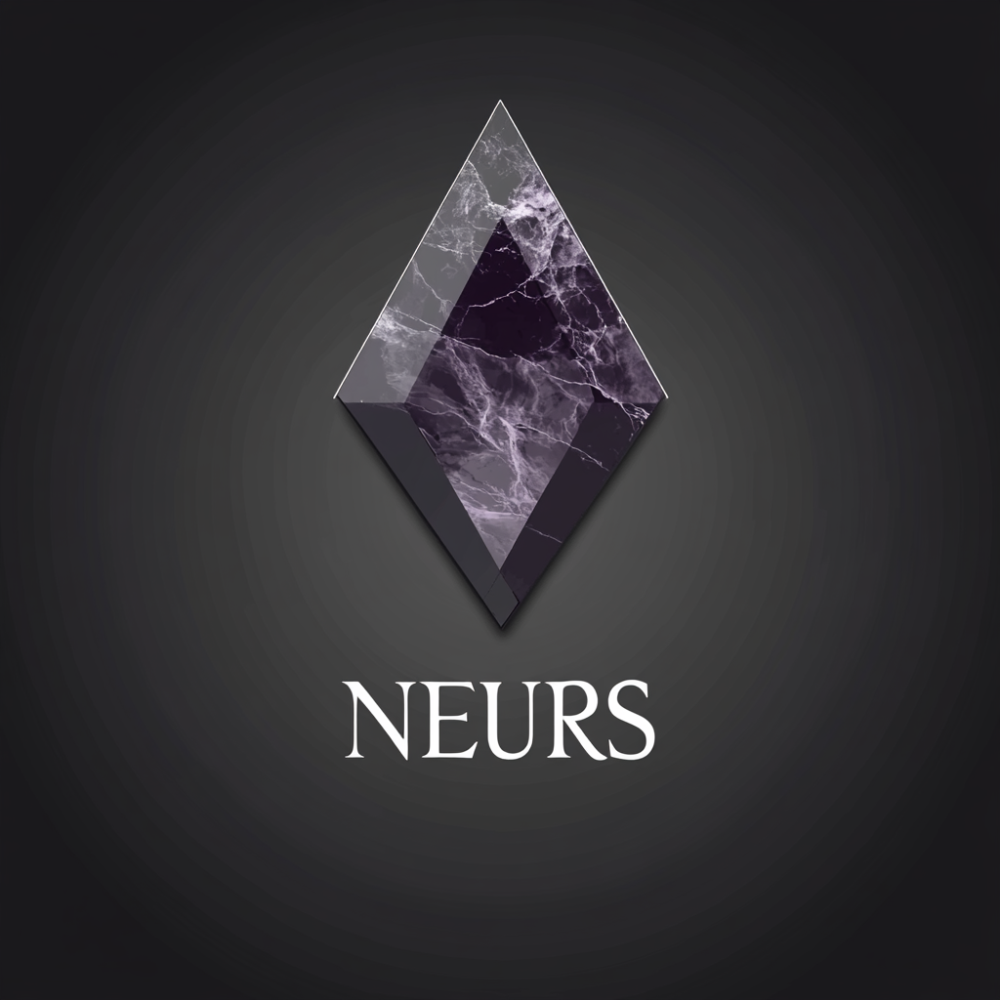

# Neurs: AI Agent Framework on Solana

<div align="center">
    
    <h3>🤖 Intelligent Agents Powered by AI on Solana</h3>
</div>

---

Neurs is a cutting-edge AI agent framework built on the Solana blockchain, enabling the creation and deployment of autonomous, intelligent agents. By combining the power of artificial intelligence with blockchain technology, Neurs provides a secure, efficient, and scalable platform for AI-driven decision making and task execution.

## ✨ Features

- **🤖 AI-Powered Agents**
  - Autonomous decision-making capabilities
  - Task execution and management
  - Learning and adaptation mechanisms

- **⚡ Solana Integration**
  - Native Solana program implementation
  - High performance and low transaction costs
  - Secure on-chain state management

- **🔧 Smart Contract Framework**
  - Modular contract architecture
  - Extensible agent behaviors
  - Comprehensive testing suite

- **🌐 Web3 Interface**
  - Modern React-based dashboard
  - Wallet integration (Phantom, Solflare, etc.)
  - Real-time agent monitoring

## 🏗️ Architecture


## 🚀 Quick Start

### Prerequisites

- Rust 1.70.0 or later
```bash
curl --proto '=https' --tlsv1.2 -sSf https://sh.rustup.rs | sh
```

- Node.js 18.0.0 or later
```bash
nvm install 18
nvm use 18
```

- Python 3.9 or later
```bash
pyenv install 3.9
pyenv global 3.9
```

- Solana CLI tools
```bash
sh -c "$(curl -sSfL https://release.solana.com/v1.16.0/install)"
```

- Anchor Framework
```bash
cargo install --git https://github.com/neurs-ai/neurs avm --locked --force
avm install latest
avm use latest
```

### Installation

1. Clone the repository:
```bash
git clone https://github.com/neurs-ai/neurs
cd Neurs
```

2. Install Solana program dependencies:
```bash
cd program
cargo build
anchor build
```

3. Install web application dependencies:
```bash
cd ../app
npm install
```

4. Install AI components:
```bash
cd ../ai
pip install -r requirements.txt
```

### Development

1. Start a local Solana validator:
```bash
solana-test-validator
```

2. Deploy the Solana program:
```bash
cd program
anchor deploy
```

3. Start the web application:
```bash
cd ../app
npm run dev
```

4. Run AI agents:
```bash
cd ../ai
python src/agent.py
```

## 🧪 Testing

```bash
# Run Solana program tests
cd program
anchor test

# Run web application tests
cd ../app
npm test

# Run AI component tests
cd ../ai
pytest
```

## 📖 Documentation

Detailed documentation is available in the [docs](./docs) directory:

- [Architecture Overview](./docs/architecture.md)
- [Smart Contract Specification](./docs/smart-contracts.md)
- [AI Agent System](./docs/ai-agents.md)
- [Web Interface](./docs/web-interface.md)
- [API Reference](./docs/api-reference.md)

## 🤝 Contributing

We welcome contributions! Please see our [Contributing Guidelines](CONTRIBUTING.md) for details.

1. Fork the repository
2. Create your feature branch (`git checkout -b feature/amazing-feature`)
3. Commit your changes (`git commit -m 'Add some amazing feature'`)
4. Push to the branch (`git push origin feature/amazing-feature`)
5. Open a Pull Request

## 📄 License

This project is licensed under the MIT License - see the [LICENSE](LICENSE) file for details.

## 🙏 Acknowledgments

- [Solana](https://solana.com) - For the amazing blockchain platform
- [Anchor Framework](https://anchor-lang.com) - For the Solana development framework
- [OpenAI](https://openai.com) - For the AI capabilities

## 📞 Contact

- GitHub: [@NeursAILabs](https://github.com/neurs-ai/neurs)
- Twitter: [@Neursdotfun](https://x.com/AiNeurs)

## 🔮 Roadmap

- [x] Core smart contract implementation
- [x] Basic AI agent framework
- [x] Web interface with wallet integration
- [ ] Advanced AI capabilities
- [ ] Multi-agent coordination
- [ ] Cross-chain integration
- [ ] Mobile application
- [ ] Governance system

---

<div align="center">
    Made with ❤️ by the Neurs Team
</div>
